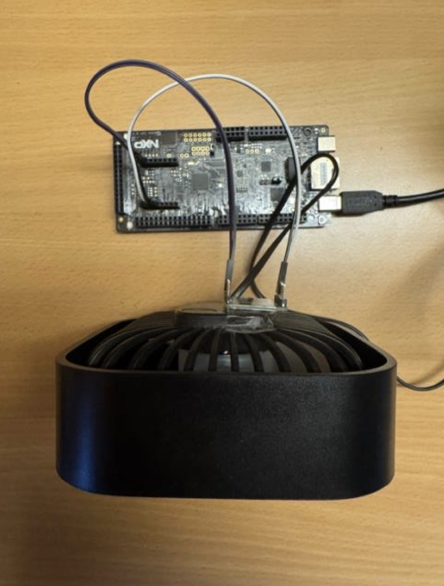
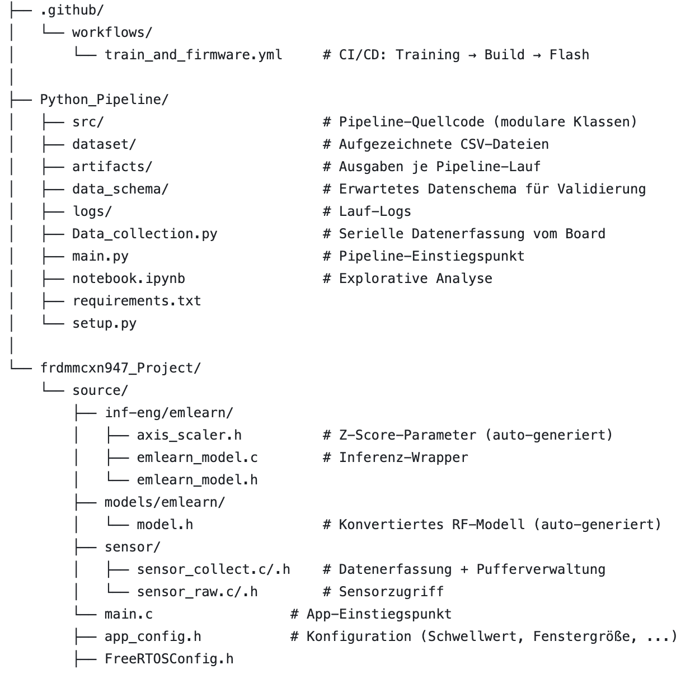
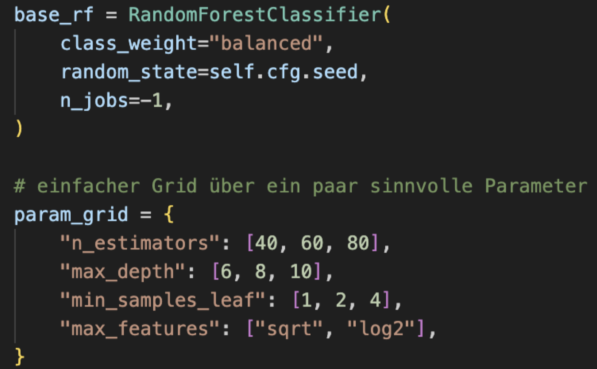
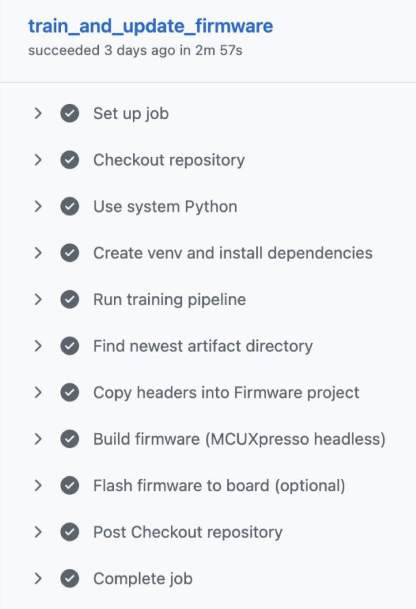

#Embedded ML Fan Monitoring
TinyML-Pipeline zur Anomalieerkennung auf einem Embedded System. Beschleunigungsdaten eines Lüfters werden gesammelt, ein Random-Forest-Klassifikator trainiert und das Ergebnis als Firmware auf einem NXP FRDM-MCXN947 deployed — vollautomatisch über GitHub Actions.

##Überblick
Das System überwacht einen Lüfter mit einem 3-Achsen-Beschleunigungssensor (ACCEL 4 CLICK, I2C3) und klassifiziert Vibrationsmuster in Echtzeit in zwei Zustände: normal und anomalie.

##Hardware
Komponenten:
MCU: NXP FRDM-MCXN947
Sensor: ACCEL 4 CLICK 
RTOS: FreeRTOS
IDE: MCUXpresso (headless build)

##Projektstruktur

            

NXP SDK-Ordner (CMSIS, board, drivers, freertos, device, ...) sind nicht aufgeführt.

##ML-Pipeline

###1. Datenerfassung
Data_collection.py empfängt Sensordaten über die serielle Schnittstelle und speichert sie als CSV. Auf dem Board läuft ein FreeRTOS-Task, der per Timer zyklisch Sensordaten liest und entweder in die Inferenz-Pipeline oder über UART weiterleitet.

###2. Vorverarbeitung

Z-Score-Normalisierung — Mittelwert und Standardabweichung werden ausschließlich aus Normal-Daten berechnet und auf alle Daten angewendet
Feature-Extraktion — pro Fenster: Mittelwert + Standardabweichung je Achse → 6 Features
Labels: normal = 1, anomalie = 0

Die C-Implementierung auf dem Mikrocontroller muss exakt dieser Vorverarbeitung entsprechen.

###3. Modelltraining
Random Forest (scikit-learn) mit automatischer Hyperparametersuche via GridSearchCV:

Alle Experimente werden mit MLflow protokolliert (Hyperparameter, Metriken, Artefakte).
###4. Modellkonvertierung
emlearn konvertiert das Modell von 32-Bit-Float auf 8-Bit-Integer und erzeugt model.h sowie axis_scaler.h — direkt einbindbare C-Header ohne externe Abhängigkeiten.
###5. Inferenz (Firmware)
Der Inferenz-FreeRTOS-Task auf dem MCU:

a)Fensterdaten aus dem Eingabepuffer lesen
b)-Z-Score-Normalisierung mit Parametern aus axis_scaler.h
c) statistische Features berechnen
d) emlearn-Inferenz → Wahrscheinlichkeiten für normal/anomalie
e) Schwellwertvergleich → binäre Klassifikation
f) Inferenzzeit in Mikrosekunden messen (optional ausgeben)

##MLOps-Struktur
Jede Pipeline-Stufe ist als eigene Klasse implementiert mit einer Config-Klasse (Parameter, Pfade) und einer Artifact-Klasse (Ausgaben für die nächste Stufe).

Stufen:
Data Ingestion: CSV-Dateien laden und organisieren
Data Validation: Vollständigkeit, Konsistenz, Data Drift prüfen
Feature Extraction: Fensterbasierte statistische Features berechnen
Model Training & Evaluation: GridSearchCV, MLflow-Logging, emlearn-Export

##CI/CD — GitHub Actions
Der Workflow train_and_firmware.yml startet automatisch bei Änderungen an der Pipeline, der Firmware oder den Workflow-Dateien — oder manuell über die GitHub-Oberfläche.

Schritte:
Set up job: Python-Umgebung + Abhängigkeiten installieren
Run training pipeline: Training, Validierung, Feature-Extraktion, GridSearchCV
Find newest artifact directory: Artefaktpfad per Zeitstempel ermitteln
Copy headers into firmware: model.h + axis_scaler.h in Firmware-Projekt kopieren
Build firmware (MCUXpresso headless): Vollständiger Build ohne GUI
Flash firmware to board: Flashen des Programms

